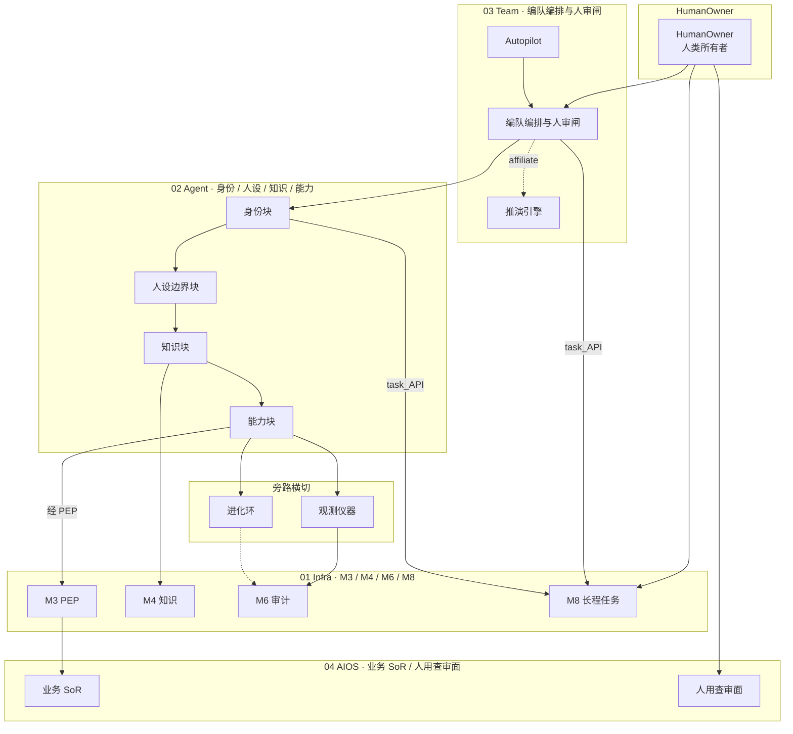

# OPC 逻辑分层 · A 图

| 字段 | 值 |
|------|-----|
| id | AIOS-GRAPH-A |
| status | refined |
| updated | 2026-08-30 |
| revision | 2 |
| owner_task | task-A |

## 读图要点

- **HumanOwner 三向入口**：人类所有者同时驱动编队编排（`orch`）、人用查审面（`humanUi`）与 M8 长程任务，形成「指挥—审阅—任务」三条并行控制面。
- **03 Team 人审闸**：`orch` 是 Agent 链与 M8 的调度枢纽；`Autopilot` 辅助编排；`simEngine`（推演引擎）以虚线 affiliate 挂接，表示可选/旁路推演而非主执行路径。
- **02 Agent 纵向链**：身份 → 人设边界 → 知识 → 能力四块顺序约束 Agent 行为边界；`idBlock` 与 `orch` 均可经 `task_API` 写入 M8。
- **旁路横切**：能力块输出分流至观测仪器（`instr`，实线审计）与进化环（`evo`，虚线审计），二者最终汇入 M6，体现「可观测、可进化、可审计」横切关注点。
- **04 AIOS ↔ 01 Infra 落地链**：知识块直连 M4；能力块经 M3 PEP 策略闸后写入业务 SoR；M6 汇聚仪器与进化环审计轨迹，M8 承接跨层长程任务状态。

## Changelog

| revision | date | note |
|----------|------|------|
| 1 | 2026-08-30 | 初稿：六层 subgraph + 指定边集 |
| 2 | 2026-08-30 | refined：补 Autopilot→orch、simEngine 虚线 affiliate、PEP/task_API 边标签与读图要点 |
