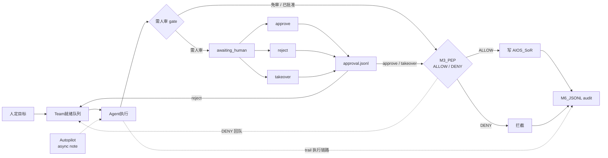

# B · Runtime Path（主运行路径）

| 字段 | 值 |
|------|-----|
| id | AIOS-GRAPH-B |
| status | refined |
| updated | 2026-08-30 |
| revision | 2 |
| owner_task | task-B |

## 读图要点

- 主链路从左到右：人定目标 → Team 就绪队列 → Agent 执行 → M3_PEP 判定 → 写 SoR 或拦截 → M6 JSONL 审计；ALLOW 走写库，DENY 走拦截，二者均汇入 audit。
- **需人审 gate** 在 Agent 与 M3_PEP 之间：高风险或策略要求时进入 `awaiting_human`，否则直达 PEP。
- 人审三出口 `approve` / `reject` / `takeover` 均写入 **approval.jsonl**；reject 回到 Team 队列，approve/takeover 继续 PEP。
- **M3_PEP DENY** 除拦截与审计外，虚线回 **Team 就绪队列** 以便重排或换策略再执行。
- **trail 执行链路**（Agent → audit 虚线）与 **Autopilot async note** 标注异步旁路：执行轨迹与自动巡航备注并行落审计，不阻塞主 ALLOW 写 SoR 路径。

## Changelog

- **rev 2 · 2026-08-30 · task-B**：refined 主运行路径图（AIOS-GRAPH-B）；补全人审 gate（awaiting_human / approve / reject / takeover / approval.jsonl）、trail 执行链路、Autopilot async note、M3_PEP DENY 虚线回队。
- **rev 1 · 2026-08-30 · task-B**：初稿骨架：人定目标 → Team 队列 → Agent → M3_PEP → SoR/拦截 → M6 audit。
