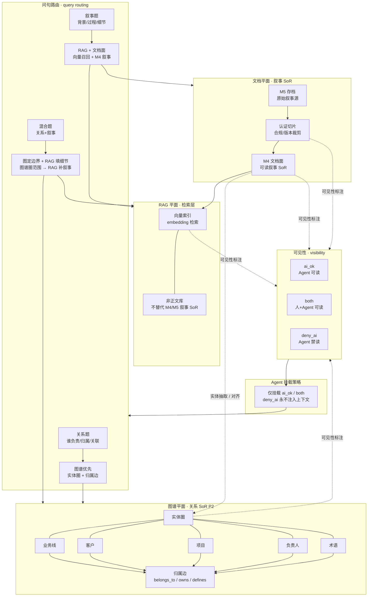

# 知识三平面 · DEC-039

| id | AIOS-GRAPH-C |
|----|--------------|
| status | refined |
| updated | 2026-08-30 |
| revision | 2 |
| owner_task | task-C |

> 文档平面 = 叙事 SoR；图谱平面 = 关系 SoR (P2)；RAG 平面 = 向量索引（非正文库）。可见性 `ai_ok` / `both` / `deny_ai`；Agent 仅挂载 `ai_ok`/`both`。

## 读图要点

- **三平面分工**：M5→认证切片→M4 承担叙事 SoR；实体圈+归属边承担关系 SoR (P2)；向量索引仅做检索，不替代正文库。
- **可见性三分**：`ai_ok`/`both`/`deny_ai` 标注于各平面产出；Agent 上下文只挂载 `ai_ok` 与 `both`，`deny_ai` 永不注入。
- **关系题走图谱**：问归属、负责人、业务线-客户-项目关联时，优先查实体圈与归属边，而非向量全文检索。
- **叙事题走 RAG+文档**：问背景、过程、细节时，以 M4 文档面为叙事锚点，向量索引做语义召回补充。
- **混合题分层**：先用图谱圈定实体边界与关系范围，再用 RAG 在边界内填充叙事细节，避免跨实体幻觉。

## Changelog

| revision | date | note |
|----------|------|------|
| 1 | — | 初稿占位（task-C） |
| 2 | 2026-08-30 | 细化三平面节点、可见性三分、Agent 挂载规则与问句路由（关系/叙事/混合） |
