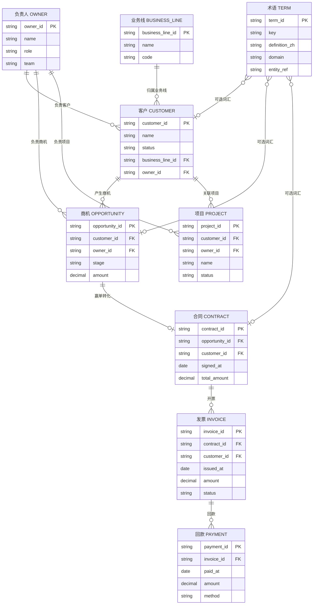

# AIOS Thin CRM · 实体关系图 (D)

| 字段 | 值 |
|------|-----|
| id | AIOS-GRAPH-D |
| status | refined |
| updated | 2026-08-30 |
| revision | 2 |
| owner_task | task-D |

## 概述

AIOS 薄 CRM 核心实体与关系：客户 → 商机 → 合同 → 发票 → 回款；负责人挂载于客户/商机/项目；客户归属业务线；项目回指客户；术语表为可选词汇表。

## 读图要点

- **主链路**：`CUSTOMER → OPPORTUNITY → CONTRACT → INVOICE → PAYMENT` 覆盖从潜客到现金的完整销售闭环，各节点以 FK 串联，便于 OPC 流程编排与状态追踪。
- **负责人 OWNER**：一对多挂载于客户、商机、项目三类对象，不直接绑定合同/发票/回款，体现「售前+交付」职责分离。
- **业务线 BUSINESS_LINE**：客户通过 `business_line_id` 归属单一业务线，支持多 BU 报表与权限隔离。
- **项目 PROJECT**：独立于商机链路，通过 `customer_id` 回指客户，用于交付/实施阶段与 CRM 主链并行存在。
- **术语 TERM**：可选词汇表，通过 `entity_ref` 软关联各实体，不参与交易约束，供 AIOS 语义层与 Agent 提示词对齐。

## Changelog

| revision | date | change |
|----------|------|--------|
| 1 | 2026-08-30 | 初稿：9 实体 + 主链/负责人/业务线/项目/术语关系 |
| 2 | 2026-08-30 | refined：补全属性字段、中文标签、术语软关联三端、读图要点 |
