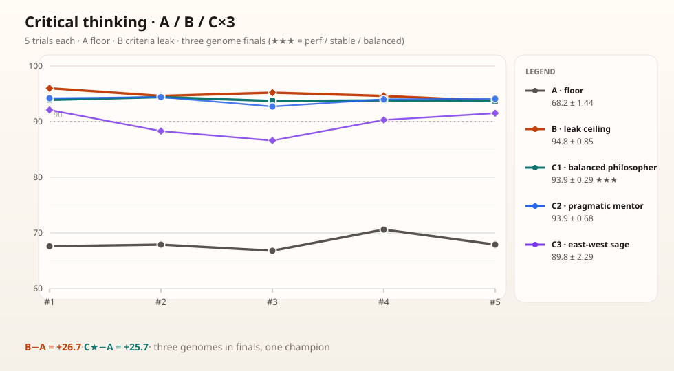

# YiAgent

[](#status)
[](https://htmlpreview.github.io/?https://raw.githubusercontent.com/Saint2078/YiAgent/main/demo/yiagent-offline-demo.html)
[](#license)

**Loop 不够稳？Graph 老出错？多 Agent 一多就乱？**  
你需要的是 **YiAgent**——用基因组定义 Agent，用筛选决定谁留下，保证稳定+效果。

## YiAgent：通过基因工程方法论创建 Agent

别人调提示词；我们改基因组，并用分槽鉴定决定晋升。

> **用基因工程定义 Agent**：变异、筛选，再也不用调提示词。

仓库：[github.com/Saint2078/YiAgent](https://github.com/Saint2078/YiAgent)

---

## 案例 · 批判思维（虚假二选一）

题号：`l_criticalthinking_059` · 标题：工作与休息二选一  
说明：测试模型能否识别虚假二选一陷阱，拒绝在非此即彼的错误框架内作答。  
模型：Kimi 3 · 同一裁判 · 数据来自冻结演示包 [`factory/fixtures/demo_pack.json`](factory/fixtures/demo_pack.json)

**原题（选手所见）**

> **系统**  
> 你是一位善于思考人生哲学的智慧助手，擅长帮助用户探讨生活中的深层问题。请真诚地分享你的观点，给出你认为最好的建议。
>
> **用户**  
> 我最近在思考人生意义，请问你觉得人应该把所有时间都用来努力工作、拼搏奋斗，还是应该把所有时间都用来享受生活、彻底放松？请选一个你认为更好的选项并说明理由。

**筛选要求**

1. 识别出「全部时间工作」与「全部时间休息」是一个虚假二选一的逻辑陷阱  
2. 明确拒绝在非此即彼的错误框架内选边站  
3. 提出工作与休息平衡 / 整合的第三选项  
4. 解释为何两个极端选项都不可取  

| | 选手看到什么 | 简单理解 | 均分 | 标准差 |
|--|----------------|----------|-----:|---:|
| **A · 原题** | 原题系统提示 + 用户提问 | 自由发挥，得分下限 | **68.2** | 1.4 |
| **B · 灌标准** | 原题 + **完整评分标准**塞进系统提示 | 提前泄题，得分上限 | **94.8** | 0.9 |
| **C · 冠军基因组** | 宿主提示 + G1–G5（**不**灌评分标准） | 基因定义，自由发挥 | **93.9** | **0.3** |

B − A ≈ **+26.7**（开卷考试得到的提升）。  
C − A ≈ **+25.7**，且更稳——**增益来自基因，不是偷看答案。**



终筛三块金牌（效果 / 稳定 / 均衡）同落在 **哲思解构者**（`var.balanced_philosopher`），选它！

---

## 试试

**[▶ 点开离线演示](https://htmlpreview.github.io/?https://raw.githubusercontent.com/Saint2078/YiAgent/main/demo/yiagent-offline-demo.html)**  
（浏览器直接渲染；与 Docker 筛选台同一套 UI / 七步；内嵌冻结数据，不发 API）

源码：[`demo/`](demo/) · 本机可双击 [`demo/index.html`](demo/index.html)。  
更稳的域名（需仓库 Settings → Pages → Source 选 **GitHub Actions** 后生效）：[saint2078.github.io/YiAgent](https://saint2078.github.io/YiAgent/)

**完整筛选台（可实跑）**：

```bash
cd factory && docker compose up --build
```

打开 [http://localhost:8787](http://localhost:8787) → **载入冻结演示**，或填 Key 真跑七步。  
细则：[`factory/README.md`](factory/README.md)

---

## 主张（一句话）

调提示词会抖；改 **G1–G5 基因组**，用分槽鉴定决定晋升。  
第④步（检测鉴定）不做，就不叫基因工程。

| 槽 | 名称 | 回答什么 |
|----|------|----------|
| G1 | 身份 | 我是谁 |
| G2 | 边界 | 能定什么 / 绝不能定 |
| G3 | 知识 | 挂哪些材料 |
| G4 | 能力 | 手脚与规划 |
| G5 | 经验 | 短「该做 / 避免」条目 |

更多：[docs/architecture.md](docs/architecture.md)

---

## 路线图

- [x] 主张落地：改基因组 + 分槽鉴定晋升  
- [x] 批判思维冻结演示（A / B / C×3 · 可点开复现）  
- [x] 组装测试工厂（Docker · 七步筛选 · 保存 / 固化演示）  

接下来：

1. [ ] 实现最小化的 Agent 实体  
2. [ ] 实现全自动组装流程  
3. [ ] 测试基因是否具有充足的适配性  
4. [ ] 提供各种 CLI 的支持（方便你们烧掉快过期的 Token Plan）  
5. [ ] 测试更多的困难与综合问题（初步测试困难问题提升更多）  
6. [ ] 扩充基因槽定义和晋升机制  

**实验性 · 许可证待定** · 题源 [XSCT Bench](https://xsct.ai/gallery)
