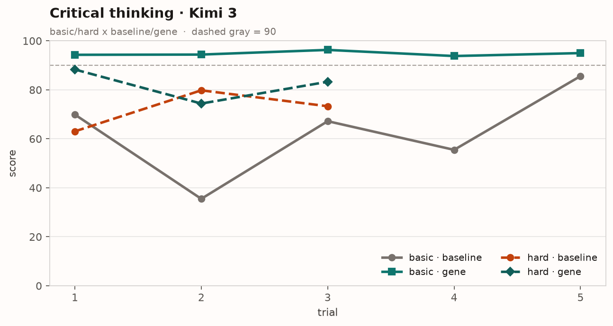
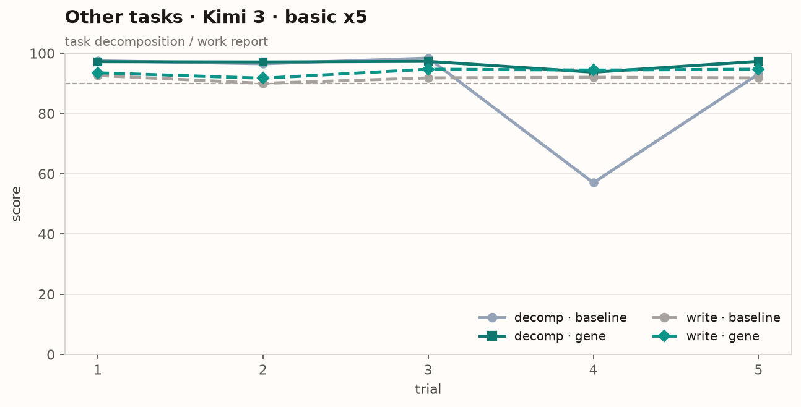
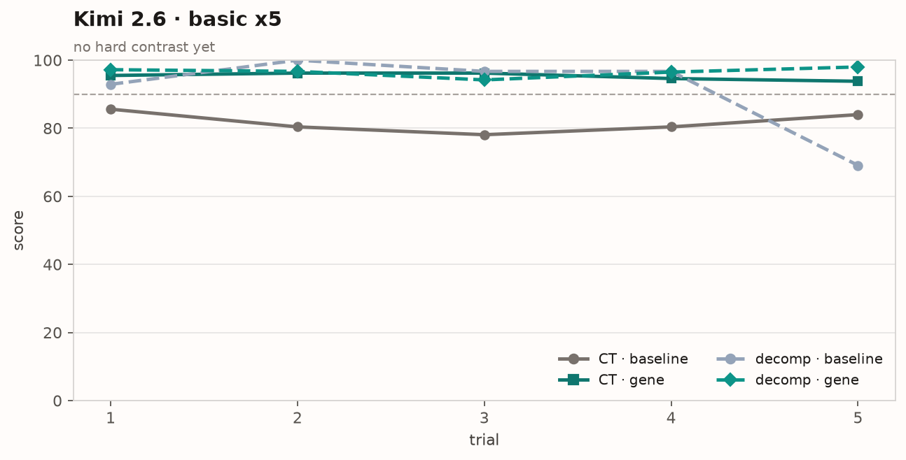

# YiAgent

[](#status)
[](#license)

## 主张

**别人调 prompt；我们改基因组，并用分槽鉴定决定晋升。**

*They tune prompts. We edit the genome — and promote only with a slot-level verdict.*

Agent 工程收成生物学同款流水线：取基因 → 组装 → 导入 → **检测鉴定**。

| | 生物学 | YiAgent |
|--|--------|---------|
| ① | 取目的基因 | **G1–G5** 等位基因（身份 / 边界 / 知识 / 能力 / 经验） |
| ② | 组装载体 | **`Assemble`** 装载 |
| ③ | 导入细胞 | 灌进运行时 |
| ④ | **检测鉴定** | **分槽打分 + 晋升门禁** |

第④步不做，就不叫基因工程——只是随机改配置。  
鉴定要答清两句：**该不该晋升？强在哪一段基因？**

仓库：[github.com/Saint2078/YiAgent](https://github.com/Saint2078/YiAgent)

---

## 数据（XSCT · basic ×5）

同一题、同一裁判：原题基线 **A** vs 基因骨架 **C**（Host + G2/G4/G5，**不是**把评分标准整份塞进 prompt）。

| 题 | 模型 | A mean | **C mean** | A sd | **C sd** |
|----|------|-------:|-----------:|-----:|---------:|
| 批判思维 | Kimi 3 | 62.7 | **94.8** | 18.6 | **0.96** |
| 任务分解 | Kimi 3 | 88.5 | **96.5** | 17.7 | **1.58** |
| 工作汇报 | Kimi 3 | 91.6 | 93.8 | 0.97 | 1.27 |
| 批判思维 | Kimi 2.6 | 81.7 | **95.3** | 3.03 | **1.05** |
| 任务分解 | Kimi 2.6 | 91.1 | **96.5** | 12.5 | **1.42** |

基线越容易翻车，基因骨架抬分、收窄波动越明显；Kimi 3 / 2.6 方向一致。（n=5，中置信；2.6 工作汇报因思维链外泄未计入。）

### 逐次分数

**批判思维（4 条线：简单/复杂 × 基线/基因）**



实线 = 简单（basic×5）；虚线 = 复杂（hard×3）。灰虚线 = 90 分参考。

**其余题 · Kimi 3（basic）**



**Kimi 2.6（basic；尚无 hard 对照）**



原始数列见 [`docs/experiments.md`](docs/experiments.md)。再生图：`docker run --rm -v "$PWD:/work" -w /work python:3.12-slim sh -c "python -m ensurepip >/dev/null && python -m pip install -q matplotlib && python scripts/gen_score_charts.py"`

---

## G1–G5

| 槽 | 名称 | 回答什么 | 变异 |
|----|------|----------|------|
| G1 | 身份 `identity` | 我是谁、怎么自报 | 低 |
| G2 | 人设与决策边界 `persona` | 能定什么 / 绝不能定 | 中高 |
| G3 | 知识 `knowledge` | 挂哪些已认证材料 | 中 |
| G4 | 能力与工具 `capability` | 手脚、规划、预算 | 高 |
| G5 | 经验策略 `experience` | 短 DO/AVOID 叠加层 | 高 |

`base(G1+G2) + layers(G3+G4) + overlays(G5[])` · [`docs/architecture.md`](docs/architecture.md)

边界→G2，规格→G4，经验→G5；裁判规则不进选手基因组。

---

## 结构 · 路线图

```
docs/           # 架构与实验
src/yiagent/    # Assemble / 晋升门禁（搭建中）
experiments/    # 可复现入口（搭建中）
```

- [x] 主张：改基因组 + 分槽鉴定晋升  
- [x] 早期 XSCT 数据  
- [ ] schema + `Assemble` 最小实现  
- [ ] 晋升 / 驳回 / 噪声不足  
- [ ] Demo + 公开晋升榜 · License  

**Experimental · License TBD** · 题源 [XSCT Bench](https://xsct.ai/gallery)
